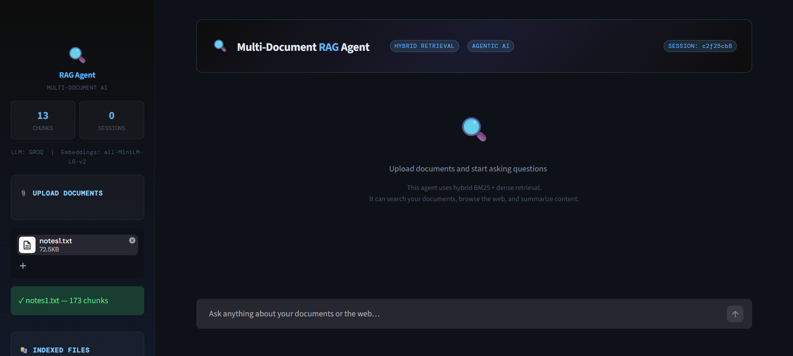
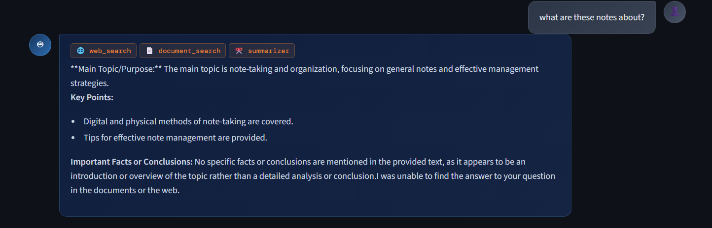
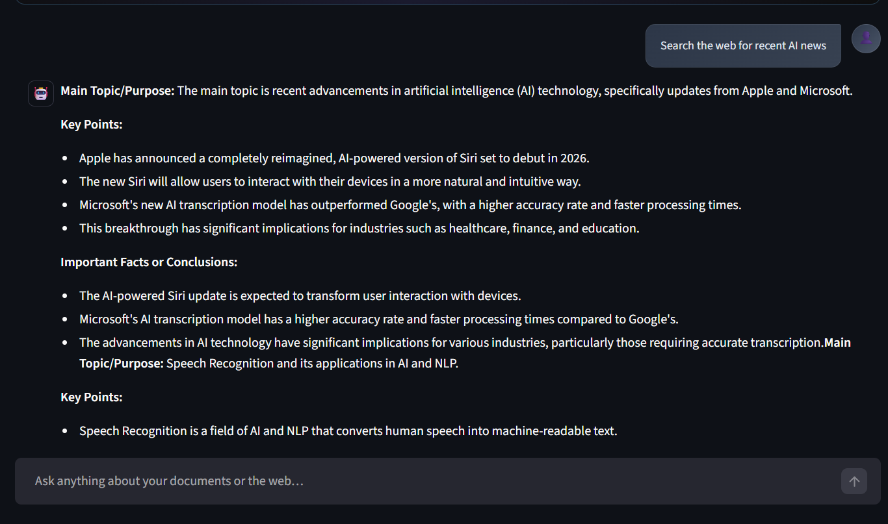

# 🔍 Multi-Document RAG Agent

A production-grade Agentic AI system that lets you upload documents and have a conversation with them. Powered by a **LangGraph ReAct agent** that autonomously decides when to search your documents, browse the web, or summarize content — with real-time streaming and persistent memory.

---

## ✨ Features

| Feature | Details |
|---|---|
| **Agentic reasoning** | LangGraph ReAct loop — agent decides tool use autonomously |
| **Hybrid retrieval** | BM25 sparse + ChromaDB dense, merged and deduplicated |
| **FlashRank reranking** | Cross-encoder reranks top candidates for higher precision |
| **Multi-tool chaining** | Can combine document search + web search in a single answer |
| **Real-time streaming** | Token-by-token SSE streaming with live tool activity indicators |
| **Persistent memory** | SQLite-backed LangGraph checkpoints survive server restarts |
| **Web search** | Tavily API integration for current events and live data |
| **Multi-format ingestion** | PDF, TXT, DOCX support |
| **Source citations** | Every answer shows which document and page it came from |
| **Two frontends** | Streamlit (local) + Gradio (HuggingFace Spaces) |

---

## 📸 Screenshots

### Dashboard & Document Upload


### Multi-tool Agentic Response
> Agent autonomously chains `web_search` · `document_search` · `summarizer` in a single query



### Live Web Search via Tavily API
> Real-time results for current events — agent decides when documents aren't enough



---

## 🏗 Architecture

```
┌─────────────────────────────────────────────────────┐
│                  Streamlit / Gradio UI               │
│          (streaming SSE · tool badges · citations)   │
└────────────────────────┬────────────────────────────┘
                         │ HTTP / SSE
┌────────────────────────▼────────────────────────────┐
│               FastAPI Backend  (:8000)               │
│  /upload  /chat  /history  /clear  /stats  /health  │
└────────────────────────┬────────────────────────────┘
                         │
┌────────────────────────▼────────────────────────────┐
│            LangGraph ReAct Agent                     │
│   ┌──────────────┐  ┌────────────┐  ┌────────────┐  │
│   │document_search│  │ web_search │  │ summarizer │  │
│   └──────┬───────┘  └─────┬──────┘  └─────┬──────┘  │
│          │                │               │          │
│   ┌──────▼───────┐  ┌─────▼──────┐        │          │
│   │ HybridRetriever│  │  Tavily   │        │          │
│   │ BM25 + Chroma │  │   API     │        │          │
│   │ + FlashRank   │  └───────────┘        │          │
│   └───────────────┘                       │          │
│                                           │          │
│   ┌──────────────────────────────────────┐│          │
│   │   SQLite Checkpoint (LangGraph)      ││          │
│   │   agent_memory.db  — persistent      ││          │
│   └──────────────────────────────────────┘│          │
└─────────────────────────────────────────────────────┘
```

---

## 🗂 Project Structure

```
rag-agent/
├── backend/
│   ├── main.py            # FastAPI app — 6 endpoints
│   ├── rag_pipeline.py    # LangGraph ReAct agent + SSE streaming
│   ├── retriever.py       # Hybrid BM25 + ChromaDB + FlashRank reranker
│   ├── memory.py          # Per-session memory + SQLite rehydration on restart
│   ├── tools.py           # @tool definitions (document_search, web_search, summarizer)
│   ├── config.py          # Pydantic settings — reads from .env
│   └── __init__.py
├── frontend/
│   ├── app.py             # Streamlit UI (streaming, tool badges, citations)
│   └── gradio_app.py      # Gradio UI for HuggingFace Spaces
├── assets/                # Screenshots for README
├── .env.example           # Template — copy to .env and fill in keys
├── requirements.txt
├── Dockerfile
├── docker-compose.yml
└── README.md
```

---

## 🚀 Quick Start (Local)

### 1. Clone and set up environment

```bash
git clone https://github.com/MOHD-OMER/rag-agent.git
cd rag-agent

conda create -n rag-agent python=3.11.15
conda activate rag-agent
pip install -r requirements.txt
```

### 2. Configure API keys

```bash
cp .env.example .env
```

Edit `.env`:

```env
GROQ_API_KEY=gsk_...
TAVILY_API_KEY=tvly-...
```

### 3. Run the backend

```bash
cd backend
uvicorn main:app --reload --port 8000
```

### 4. Run the frontend (new terminal)

```bash
# From project root
streamlit run frontend/app.py --server.port 8501
```

Open **http://localhost:8501**

---

## 🐳 Docker

```bash
cp .env.example .env
docker compose up --build
```

| Service | URL |
|---|---|
| Streamlit UI | http://localhost:8501 |
| Gradio UI | http://localhost:7860 |
| FastAPI docs | http://localhost:8000/docs |

---

## ⚙️ Configuration

| Variable | Default | Description |
|---|---|---|
| `GROQ_API_KEY` | — | Groq API key (required) |
| `TAVILY_API_KEY` | — | Tavily search key (optional) |
| `LLM_PROVIDER` | `groq` | `groq` or `ollama` |
| `GROQ_MODEL` | `llama-3.1-8b-instant` | Groq model name |
| `EMBEDDING_MODEL` | `all-MiniLM-L6-v2` | HuggingFace sentence-transformers model |
| `CHROMA_PERSIST_DIR` | `./chroma_db` | ChromaDB persistence path |
| `CHUNK_SIZE` | `512` | Document chunk size (tokens) |
| `CHUNK_OVERLAP` | `64` | Chunk overlap (tokens) |
| `TOP_K_RETRIEVAL` | `6` | Number of chunks returned after reranking |
| `MEMORY_WINDOW_SIZE` | `10` | Sliding window — last N turns kept in context |

---

## 🔌 API Reference

| Method | Endpoint | Description |
|---|---|---|
| `GET` | `/health` | Health check |
| `GET` | `/stats` | Chunk count, active sessions, LLM info |
| `POST` | `/upload` | Upload and index a PDF, TXT, or DOCX file |
| `POST` | `/chat` | Send message — streaming SSE or JSON response |
| `GET` | `/history` | Get conversation history for a session |
| `DELETE` | `/clear` | Clear memory and/or vector store |

### SSE event types (stream=true)

```
{ "type": "session_id", "session_id": "..." }
{ "type": "tool_start",  "tool": "document_search", "input": "..." }
{ "type": "tool_end",    "tool": "document_search" }
{ "type": "token",       "content": "The key..." }
{ "type": "done",        "sources": [...], "tool_calls": [...] }
{ "type": "error",       "content": "..." }
```

---

## 🧠 How It Works

### Retrieval pipeline

1. **BM25** (sparse) — keyword frequency matching across all indexed chunks
2. **ChromaDB** (dense) — semantic similarity via `all-MiniLM-L6-v2` embeddings
3. **Merge** — results deduplicated by content, BM25 results prioritized
4. **FlashRank** — cross-encoder reranks the merged candidate pool

### Agent loop

1. Decides which tool(s) to call based on the query
2. Executes tools — can chain multiple in sequence
3. Synthesizes a final cited answer from tool outputs
4. Saves the full reasoning trace as a checkpoint to SQLite

---

## 🔧 Known Limitations

- **Groq rate limits** — free tier ~30 req/min. Wait a few seconds if you hit 429 errors
- **FlashRank cold start** — downloads reranker model (~50 MB) on first use, adds ~10s
- **DOCX support** — requires `unstructured[docx]` to be installed

---

## 🗺 Roadmap

- [ ] URL ingestion (web scraping + indexing)
- [ ] Multi-user auth with isolated vector store namespaces
- [ ] Streaming support in Gradio frontend
- [ ] Evaluation harness with RAGAS metrics
- [ ] Multimodal RAG (images inside PDFs)

---

## 📄 License

MIT License — see [LICENSE](LICENSE) for details.